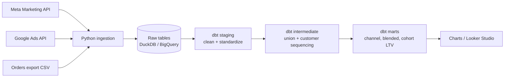
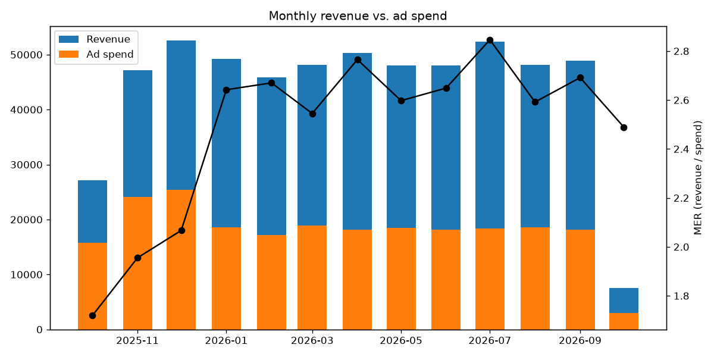
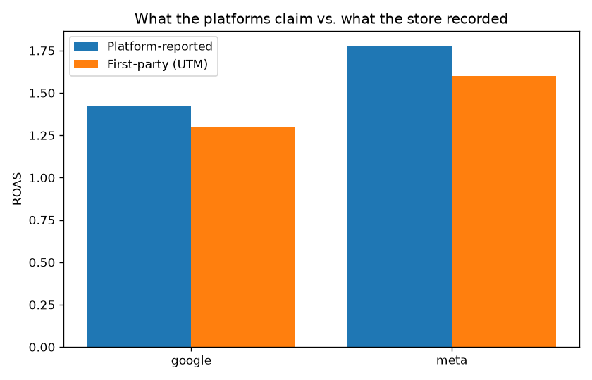
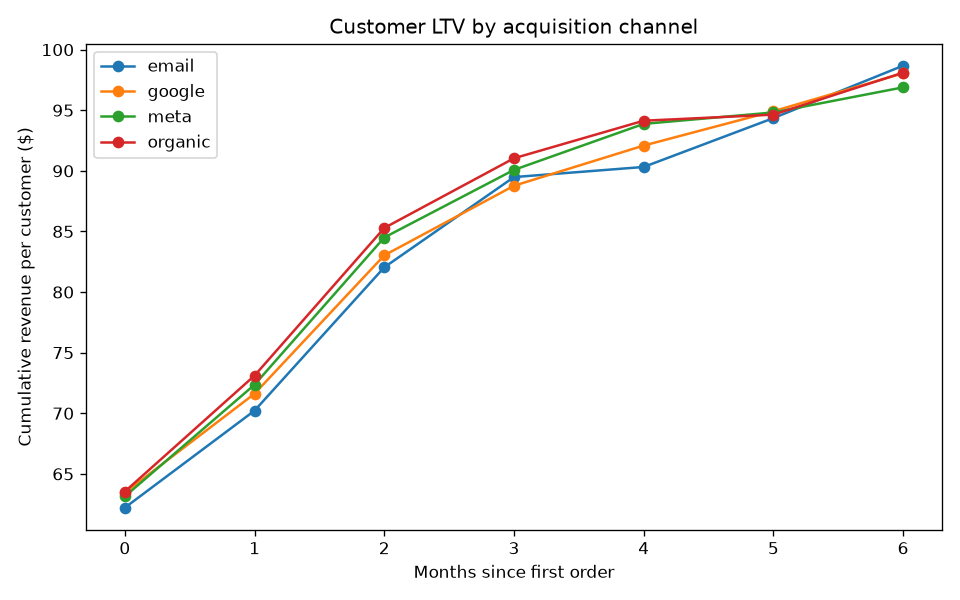

# Marketing Data Stack


An end-to-end analytics engineering project that answers the questions every
performance marketing team asks: **What does a customer actually cost? Are the ad
platforms over-reporting? Which channel brings in the most valuable customers?**

It pulls daily campaign data from the **Meta Marketing API** and **Google Ads API**,
combines it with first-party order data, models it in **dbt**, tests it, and
produces blended CAC, MER, ROAS, and cohort LTV.

I've spent 10+ years in performance marketing and paid subscriber acquisition, where the hardest part was never running the campaigns — it was trusting the numbers. Platform-reported ROAS looks great right up until you compare it to actual subscription revenue and find 40% of your spend has no traceable attribution to a paying customer. I built this project because I got tired of rebuilding that math by hand every week: pulling Meta exports, reconciling Google, running the contribution model in a spreadsheet, and starting over when someone changed a filter. It pulls ad platform data into a tested data model so CAC, MER, and LTV are calculated one consistent way, every day — no manual assembly, no platform credit-claiming, just the number the business actually cares about.

## Architecture


    


| Layer | Tool | What it does |
|---|---|---|
| Extract & load | Python (`requests`, `google-ads`) | Pulls daily campaign data and loads it raw, idempotently |
| Warehouse | DuckDB (local) or BigQuery (cloud) | Same models run on both via dbt targets |
| Transform | dbt | Staging → intermediate → marts, with 22 data tests |
| Quality | dbt tests + pytest + GitHub Actions | Every push rebuilds the whole pipeline from scratch |
| Visualize | matplotlib / Looker Studio | Charts below; BigQuery tables connect straight to Looker Studio |

## Results (sample data)







## Metric definitions

| Metric | Definition | Model |
|---|---|---|
| **Blended CAC** | Total ad spend ÷ all new customers | `fct_blended_daily` |
| **Channel CAC** | Channel spend ÷ new customers first acquired on that channel | `fct_channel_daily` |
| **MER** | Total revenue ÷ total ad spend | `fct_blended_daily` |
| **Platform ROAS** | Conversion value reported by Meta/Google ÷ spend | `fct_channel_daily` |
| **Attributed ROAS** | First-party revenue with matching UTM source ÷ spend | `fct_channel_daily` |
| **Cohort LTV** | Cumulative revenue ÷ customers in the first-order-month cohort | `fct_cohort_ltv` |

Attribution is **first-touch by UTM source**: a customer belongs to the channel of
their first order. The gap between platform ROAS and attributed ROAS is the point:
platforms count view-through and modeled conversions, the store does not.

## Run it yourself (about 2 minutes, no credentials needed)

```bash
git clone https://github.com/AJVALLONE/marketing-data-stack.git
cd marketing-data-stack
python -m venv .venv && source .venv/bin/activate   # Windows: .venv\Scripts\activate
pip install -r requirements.txt

python -m ingestion.run_pipeline                    # generate + load sample data
dbt build --project-dir dbt --profiles-dir dbt      # build and test every model
python analysis/report.py                           # regenerate the charts
```

Or with `make`: `make install all`.

The sample generator produces data in the same shape the real APIs return (for
example, Google's cost in micros), so the dbt models are identical for sample and live runs.

## Run it on real data (BigQuery)

```bash
pip install -r requirements-live.txt
cp .env.example .env                 # add API credentials and GCP project
gcloud auth application-default login
make prod
```

## Project structure

```
ingestion/          Python extract + load (Meta, Google Ads, orders CSV, sample generator)
dbt/models/
  staging/          One model per source: rename, cast, convert units, map UTMs
  intermediate/     Union ad platforms; sequence orders per customer
  marts/            fct_channel_daily, fct_blended_daily, fct_cohort_ltv
dbt/tests/          Custom data tests (revenue reconciliation, LTV monotonicity)
dbt/macros/         safe_divide
analysis/           Chart generation
tests/              pytest unit tests
.github/workflows/  CI: full pipeline rebuild on every push
```

## Design decisions

- **ELT, not ETL.** Python only extracts and loads; all business logic lives in
  version-controlled, tested SQL.
- **Idempotent loads.** Each run replaces the raw tables, so re-running never duplicates data.
- **Warehouse-portable SQL.** dbt cross-database macros let the same models run
  on DuckDB for development and BigQuery for production.
- **Tests that catch real marketing data problems:** duplicate campaign-days,
  unmapped UTM sources, and revenue silently dropped in joins.

## What I'd add next

- Incremental models and a date spine so cohorts with quiet months show flat LTV
- Campaign-level and creative-level marts
- Multi-touch attribution using session data
- Orchestration with Dagster or Airflow on a daily schedule
